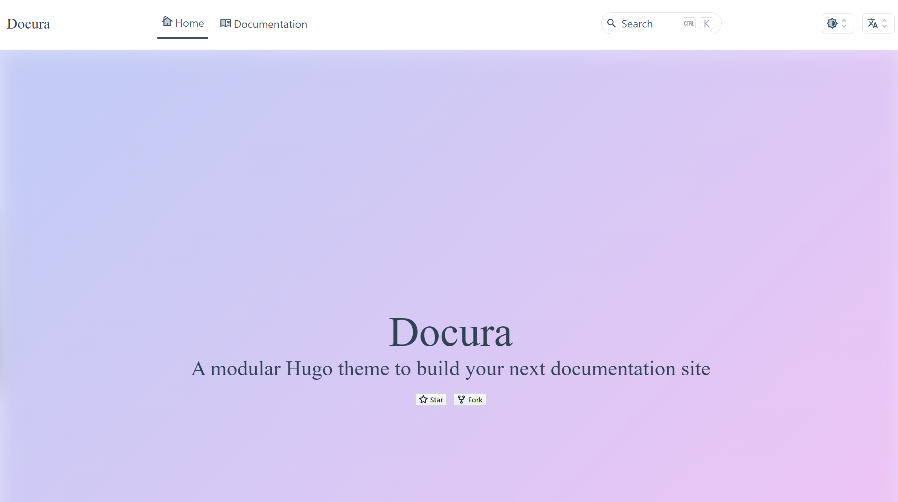

### 3. github 리포지터리를 hugo 블로그로 만들기


github 리포지터리 페이지 진입 \> Settings 클릭


<br>


Settings 페이지에서는 아래 캡처에 표시한 숫자순으로 클릭해서 메뉴를 이동한다.

- 1 : Pages 메뉴 클릭
- 2,3 : Build and deployment \> Source \> Github Actions 를 선택


<br>


이번에는 Actions 메뉴로 진입한다. 그리고 검색창에 hugo 를 입력하고 엔터키를 누른다. 그러면 다음 그립 처럼 `Simple workflow` 라는 버튼이 난타난다.


<br>


Configure 버튼을 눌러준다.


<br>

`.github/workflows/hugo.yml` 파일 편집창을 수정한다.

기본 yaml 빌드 파일이 제공되는데 나는 이 파일에서 몇몇 부문을 살짝 수정했다.

수정한 yaml 내용 전체는 코드로 첨부했다.

내용을 수정을 완료했으면 `Commit Changes` 버튼을 클릭한다.


<br>


수정한 yaml 코드의 전체 내용은 아래와 같다.

`.github/workflows/hugo.yml`

```yaml
# Sample workflow for building and deploying a Hugo site to GitHub Pages
name: Deploy Hugo site to Pages

on:
  # Runs on pushes targeting the default branch
  push:
    branches: ["main"]

  # Allows you to run this workflow manually from the Actions tab
  workflow_dispatch:

# Sets permissions of the GITHUB_TOKEN to allow deployment to GitHub Pages
permissions:
  contents: read
  pages: write
  id-token: write

# Allow only one concurrent deployment, skipping runs queued between the run in-progress and latest queued.
# However, do NOT cancel in-progress runs as we want to allow these production deployments to complete.
concurrency:
  group: "pages"
  cancel-in-progress: false

# Default to bash
defaults:
  run:
    shell: bash

jobs:
  # Build job
  build:
    runs-on: ubuntu-latest
    env:
      HUGO_VERSION: 0.114.0
    steps:
      - name: Install Hugo CLI
        run: |
          wget -O ${{ runner.temp }}/hugo.deb https://github.com/gohugoio/hugo/releases/download/v${HUGO_VERSION}/hugo_extended_${HUGO_VERSION}_linux-amd64.deb \
          && sudo dpkg -i ${{ runner.temp }}/hugo.deb
      - name: Install Dart Sass
        run: sudo snap install dart-sass
      - name: Checkout
        uses: actions/checkout@v3
        with:
          submodules: recursive
          fetch-depth: 0
      - name: Setup Pages
        id: pages
        uses: actions/configure-pages@v3
      - name: Install Node.js dependencies
        run: "[[ -f package-lock.json || -f npm-shrinkwrap.json ]] && npm ci || true"
      - name: Build with Hugo
        env:
          # For maximum backward compatibility with Hugo modules
          HUGO_ENVIRONMENT: production
          HUGO_ENV: production
        run: |
          hugo \
            --gc \
            --minify \
            --baseURL "${{ steps.pages.outputs.base_url }}/"
      - name: Upload artifact
        uses: actions/upload-pages-artifact@v2
        with:
          path: ./public

  # Deployment job
  deploy:
    environment:
      name: github-pages
      url: ${{ steps.deployment.outputs.page_url }}
    runs-on: ubuntu-latest
    needs: build
    steps:
      - name: Deploy to GitHub Pages
        id: deployment
        uses: actions/deploy-pages@v2

```

<br>


Commit 이 완료되면 다음 그림 처럼 hugo.yml 이 빌드되고 있음을 확인 가능하다.


빌드가 완료된 모습이다.


<br>

deploy 태스크 밑에 생성된 링크를 눌러서 이동해보면 아래와 같은 화면이 나타난다.

URL 의 규칙은 https://[깃헙계정].github.io/[리포지터리명] 이다.

> 참고) 깃헙 계정 내에 `[깃헙계정].github.io` 라는 이름의 리포지터리를 굳이 만들지 않아도 잘 동작한다.

